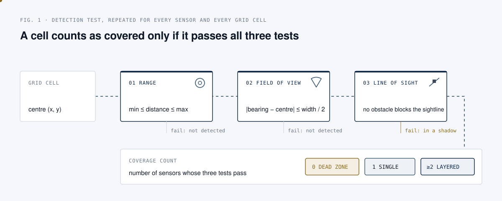
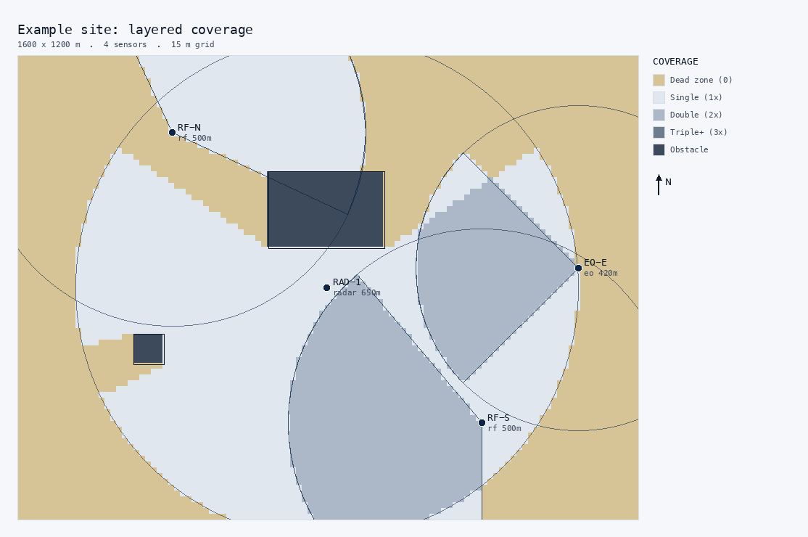

<p align="center">
  
</p>

<p align="center">
  <a href="https://github.com/darkanalytica1/c-uas-coverage-planner/actions/workflows/tests.yml"></a>
  
  
</p>

## What this is

A small, tested Python planning aid for counter-drone (C-UAS) site layouts. You describe a site as a JSON file: its size, the detection sensors (radar, RF, electro-optical, acoustic) with their range and field of view, and the buildings or terrain blocks that mask line of sight. The planner computes, cell by cell, how many sensors can see each part of the site, reports coverage, overlap and the largest contiguous dead zone, and renders a map.

## Why it matters

A single sensor ring looks like protection and is not. Buildings, terrain and sensor sectors leave gaps, and layered defence exists precisely to cover them. The hard part of counter-drone site design is not the datasheet range of a sensor; it is where the overlapping coverage actually lands once the real site gets in the way. A low, slow drone does not need the whole perimeter to be open, only one corridor.

The planner turns "we have four sensors" into a reviewable statement such as "43% of open ground is uncovered, and the largest gap is about 436,000 m² on the eastern side". Because the site is plain JSON, a proposed layout can be diffed, reviewed and re-run like code when a sensor moves or a building goes up.

## How it works

<p align="center">
  
</p>

<p align="center">
  
</p>

## Quick start

```bash
git clone https://github.com/darkanalytica1/c-uas-coverage-planner
cd c-uas-coverage-planner
python3 -m venv .venv && source .venv/bin/activate
pip install -r requirements.txt pytest

python -m pytest -q                                   # 11 tests
python -m cuas plan examples/example.json --out map.png
```

Output for the bundled example site (1600 x 1200 m, 15 m grid, one radar, two RF sectors, one EO sector, two obstacles):

```
coverage        : 56.6% of open ground
dead zones      : 43.4%
max overlap     : 2 sensors
redundancy      :
    dead       : 43.4%
      1x       : 37.8%
      2x       : 18.9%
worst dead zone : 436,275 m^2 around (1343, 721)
```

<p align="center">
  
</p>

Dead zones are shaded in the accent colour, single and double coverage in graded navy tints, obstacles in dark grey; each sensor is drawn with its range ring and field-of-view wedge.

### Describing a site

```json
{
  "name": "Example site",
  "width_m": 1600, "height_m": 1200, "resolution_m": 15,
  "sensors": [
    {"name": "RAD-1", "kind": "radar", "x": 800, "y": 600, "range_m": 650},
    {"name": "RF-N", "kind": "rf", "x": 400, "y": 1000, "range_m": 500,
     "fov_center_deg": 45, "fov_width_deg": 140}
  ],
  "obstacles": [
    {"name": "hangar", "vertices": [[650,700],[950,700],[950,900],[650,900]]}
  ]
}
```

Coordinates are metres in a local plane, x east and y north. Bearings are compass degrees (0 is north, clockwise). A `fov_width_deg` of 360 is an omnidirectional sensor; `min_range_m` models a blind zone close to the sensor.

### From Python

```python
from cuas import Sensor, Scenario, compute
from cuas.stats import summarise

sc = Scenario("site", 1000, 1000, resolution_m=10,
              sensors=[Sensor("R1", 500, 500, 400, "radar"),
                       Sensor("RF", 200, 200, 350, "rf", fov_center_deg=45, fov_width_deg=120)])
print(summarise(compute(sc)).as_text())
```

## Method

1. **Grid.** The site is divided into square cells of `resolution_m`. Each cell is represented by its centre point.
2. **Obstacles.** Cells whose centre lies inside an obstacle polygon (ray-casting point-in-polygon test) are removed from the open ground; they cannot be covered and are excluded from the percentages.
3. **Range.** For each sensor, a cell passes if `min_range_m ≤ distance ≤ range_m`.
4. **Field of view.** The compass bearing from sensor to cell must lie within half the sector width of the sector centre, with wrap-around at north handled explicitly.
5. **Line of sight.** The straight segment from the sensor to the cell centre is tested against every obstacle edge with a vectorised orientation (segment intersection) test. Any crossing masks the cell for that sensor.
6. **Count.** Coverage count per cell is the number of sensors passing all three tests. Statistics report the share of open ground at each count, the maximum overlap, and the largest 4-connected dead-zone region (area and centroid).

All geometry is vectorised over the whole grid with numpy; the example site (roughly 8,500 cells, four sensors, two obstacles) computes in well under a second.

| Module | Role |
| --- | --- |
| `cuas/model.py` | `Sensor`, `Obstacle`, `Scenario` dataclasses with input validation |
| `cuas/geometry.py` | Grid, bearings, sectors, point-in-polygon, line-of-sight masking |
| `cuas/coverage.py` | Per-sensor masks and the coverage count |
| `cuas/stats.py` | Coverage, redundancy and largest dead zone |
| `cuas/render.py` | PNG map rendering (Pillow) |
| `cuas/scenario_io.py`, `cuas/cli.py` | JSON load/save and the `plan` command |

## Limitations and assumptions

This is a **geometry planning aid**, not a propagation or radar-performance model. State these limits in any output you share.

- **Two-dimensional.** The model is a top-down plane. It does not use terrain elevation, sensor mast height, target altitude or earth curvature, so it will overstate coverage at long range and against targets flying low behind terrain. Radar horizon has to be checked separately.
- **Binary detection.** A cell is covered or not. There is no probability of detection, no dependence on target size, radar cross-section, RF emissions or weather, and no false-alarm modelling.
- **Obstacles are opaque and infinitely tall.** Any obstacle edge between sensor and cell blocks it completely. Real buildings may be overflown by the line of sight, and vegetation is partly transparent to some sensors.
- **No multipath, diffraction or interference.** RF and radar effects such as reflections, clutter and ground bounce are ignored.
- **Detection only.** The model says where a sensor could see; it does not model tracking, classification, handover between sensors or the effector layer.
- **Resolution matters.** Cells are sampled at their centre, so thin obstacles or narrow gaps smaller than the grid spacing can be missed. Use a finer `resolution_m` for final checks.

It is not a substitute for a proper siting survey with measured sensor performance.

## Sources

- M. I. Skolnik, *Introduction to Radar Systems*, 3rd ed., McGraw-Hill, 2001: radar range, horizon and clutter, the effects this tool deliberately leaves out.
- M. de Berg, O. Cheong, M. van Kreveld, M. Overmars, *Computational Geometry: Algorithms and Applications*, 3rd ed., Springer, 2008: segment intersection and point-in-polygon tests used for line-of-sight masking.

The example site is fictional.

## License

MIT. See [LICENSE](LICENSE).
